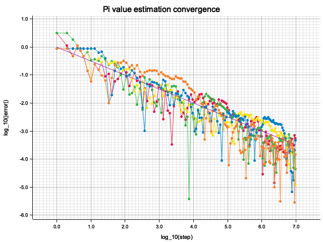
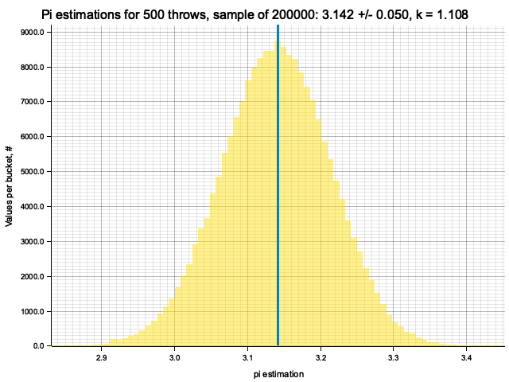
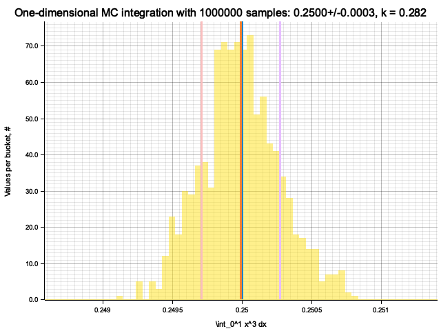
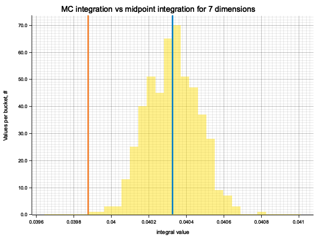
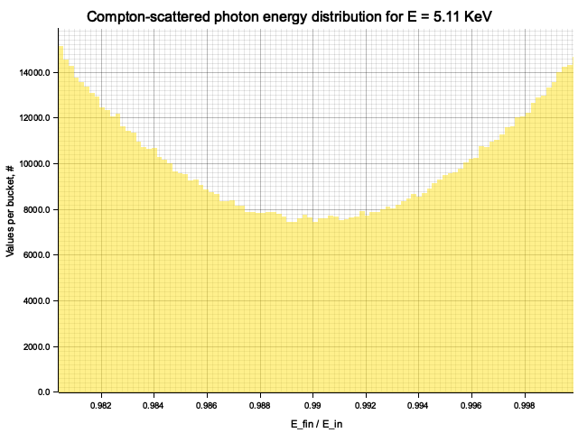
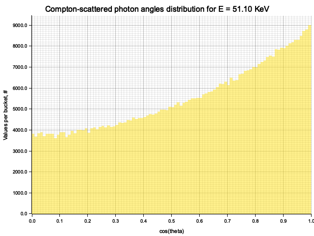
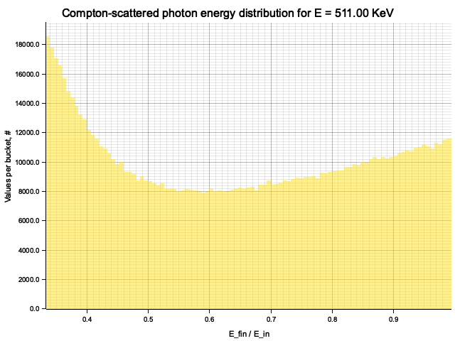
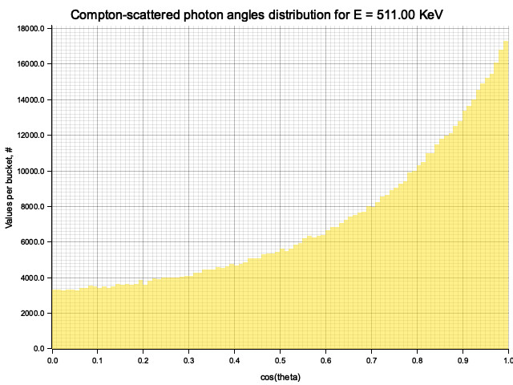
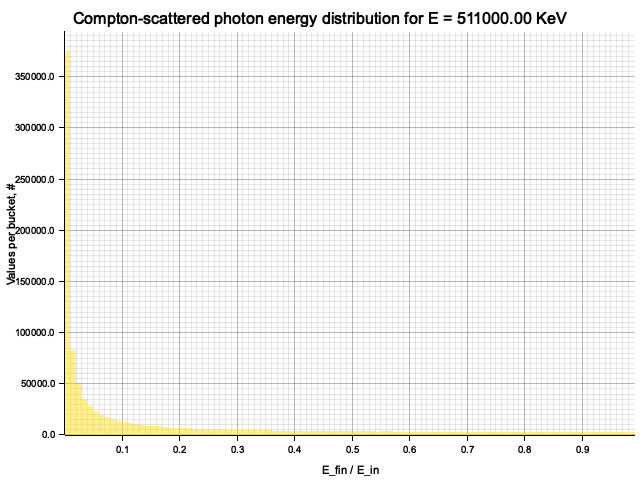
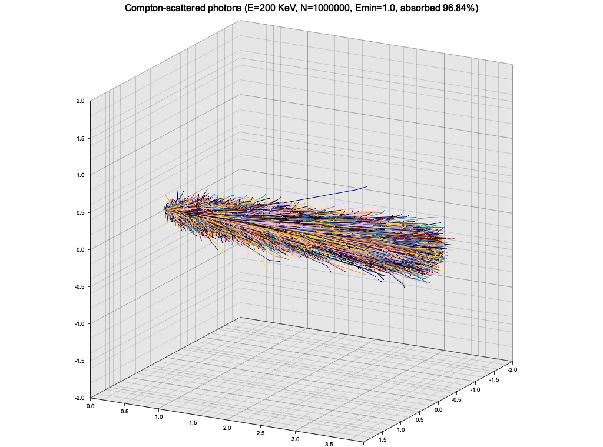

<!-- DO NOT EDIT, GENERATED AUTOMATICALLY -->

# LE-6 Monte Carlo techniques: exercises

Igor Vaiman

## Introduction

The exercises are done in Rust programming language. It's not widely used in physics
community but hopefully can see wider adoption in the future. In combines access to
low-level performance and fine-grained control with high-level features of modern programming
languages. Its emphasis on memory safety, "fearless concurrency" and compile-time error
detection might be helpful in parallelizing scientific tasks.

## Ex. 1: Uniform random sampling


<details>
<summary>Source code</summary>

```rust
use crate::plot::{plot_histogram, AxLim};
use ndhistogram::{
    axis::{Axis, UniformNoFlow},
    ndhistogram, AxesTuple, Histogram, VecHistogram,
};

use num::{cast, traits::WrappingMul, Integer, NumCast};
use std::fmt::Display;

enum Modulus<T> {
    TypeMax,
    Value(T),
}

struct MCG<T: Integer + Display + WrappingMul + Copy> {
    // Multiplicative Congruential Generator
    init: T,
    mult: T,
    modulus: Modulus<T>,

    // generator state
    current: T,
    step: usize,
}
impl<T: Integer + Display + WrappingMul + Copy> Iterator for MCG<T> {
    type Item = T;

    fn next(&mut self) -> Option<T> {
        self.step += 1;
        self.current = match self.modulus {
            Modulus::TypeMax => self.current.wrapping_mul(&self.mult),
            Modulus::Value(m) => (self.current * self.mult).rem(m),
        };

        if !self.current.is_zero() && self.current != self.init {
            return Some(self.current);
        } else {
            return None;
        }
    }
}

impl<T: Integer + Display + WrappingMul + Copy> std::fmt::Display for MCG<T> {
    fn fmt(&self, f: &mut std::fmt::Formatter<'_>) -> std::fmt::Result {
        f.write_str(&format!(
            "MCG {{ init: {}, mult: {} }}",
            self.init, self.mult
        ))
    }
}

impl<T: Integer + Display + WrappingMul + NumCast + Copy> MCG<T> {
    fn new(init: T, mult: T, modulus: Modulus<T>) -> MCG<T> {
        MCG {
            init,
            mult,
            modulus,
            current: init,
            step: 0,
        }
    }
    fn new_modulo_type_max(init: T, mult: T) -> MCG<T> {
        MCG::new(init, mult, Modulus::TypeMax)
    }

    fn reset(&mut self) -> () {
        self.current = self.init;
        self.step = 0;
    }

    fn calculate_period(&mut self) -> usize {
        self.reset();
        for _ in self.into_iter() {} // exhausting the iterator
        let period = self.step.to_owned();
        self.reset();
        return period;
    }

    fn run_tests(mut self, name: &str) -> () {
        println!("\nTesting {}: {}", name, &self);
        self.reset();

        let mut timer = std::time::Instant::now();
        let period = self.calculate_period();
        println!(
            "Full iteration: {} steps (log2(steps) = {}), took {:.2} seconds",
            period,
            (period as f64).log2(),
            timer.elapsed().as_secs_f32()
        );

        for sample_size in [
            Some(2usize.pow(10)),
            Some(2usize.pow(15)),
            Some(2usize.pow(20)),
            Some(2usize.pow(25)),
            None,
        ] {
            println!("\nHistograming with sample size = {:?}", sample_size);
            timer = std::time::Instant::now();
            let mut hist = ndhistogram!(UniformNoFlow::new(100, 0.0, 1.0));
            let scale = 1.0 / (u32::MAX as f64 - 1.0);
            self.reset();
            for (idx, i) in (&mut self).enumerate() {
                hist.fill(&(scale * cast::<T, f64>(i).unwrap()));
                if let Some(limit) = sample_size {
                    if idx == limit {
                        break;
                    }
                }
            }
            println!(
                "Histogram filled in {:.2} sec",
                timer.elapsed().as_secs_f32()
            );
            let chi2_per_dof = uniform_chi2_per_dof(&hist, self.step);
            println!("Histogram chi2 / d.o.f. = {}", chi2_per_dof);

            let log2_size = (self.step as f64).log2();
            plot_histogram(
                &hist,
                &format!(
                    "{}, 2^{:.0} samples, chi2/dof = {:.2}",
                    name, log2_size, chi2_per_dof
                ),
                "standard uniform value",
                &format!("out/ex1/{}-2^{:.0}.png", name, log2_size),
                AxLim::FromData,
                None,
            )
            .expect("Failed to plot histogram");
        }
    }
}

pub fn ex1() {
    println!("\nEx 1: Uniform random sampling");
    MCG::<u32>::new_modulo_type_max(987654321, 663608941).run_tests("from exercise");
    MCG::<u32>::new_modulo_type_max(10, 9).run_tests("poorly selected params");

    println!("\n\nEx 1.1: MINSTD algorithm");
    let m = 2u64.pow(31) - 1;
    let m_f64 = m as f64;
    for seed in [1, 7u64.pow(2), 2u64.pow(4)] {
        let mut minstd = MCG::<u64>::new(seed, 16807, Modulus::Value(m));
        let start = std::time::Instant::now();
        let period = minstd.calculate_period();
        println!(
            "Seed {:<10} -> period {:>9} ({:.2}% of range, calculated in {:.2} sec)",
            seed,
            period,
            100.0 * (period as f64) / (m_f64),
            start.elapsed().as_secs_f32(),
        );
    }
}

fn uniform_chi2_per_dof(
    hist: &VecHistogram<AxesTuple<(UniformNoFlow<f64>,)>, f64>,
    total_samples: usize,
) -> f64 {
    let ax = &hist.axes().as_tuple().0;
    let bin_count = ax.num_bins() as f64;
    let bin_count_mean = total_samples as f64 / bin_count;
    let mut chi2: f64 = 0.0;
    for value in hist.values() {
        // Pearson's chi squared for binned data
        chi2 += (bin_count_mean - value).powi(2) / bin_count_mean;
    }
    return chi2 / bin_count;
}

```

</details>


<details>
<summary>Execution log</summary>

```

Ex 1: Uniform random sampling

Testing from exercise: MCG { init: 987654321, mult: 663608941 }
Full iteration: 1073741824 steps (log2(steps) = 30), took 1.03 seconds

Histograming with sample size = Some(1024)
Histogram filled in 0.00 sec
Histogram chi2 / d.o.f. = 0.7402439024390247
Histogram has been saved to out/ex1/from exercise-2^10.png

Histograming with sample size = Some(32768)
Histogram filled in 0.00 sec
Histogram chi2 / d.o.f. = 1.0199697885196377
Histogram has been saved to out/ex1/from exercise-2^15.png

Histograming with sample size = Some(1048576)
Histogram filled in 0.00 sec
Histogram chi2 / d.o.f. = 1.3205646414140306
Histogram has been saved to out/ex1/from exercise-2^20.png

Histograming with sample size = Some(33554432)
Histogram filled in 0.09 sec
Histogram chi2 / d.o.f. = 0.8355132125165103
Histogram has been saved to out/ex1/from exercise-2^25.png

Histograming with sample size = None
Histogram filled in 3.01 sec
Histogram chi2 / d.o.f. = 0.000000016503036022602618
Histogram has been saved to out/ex1/from exercise-2^30.png

Testing poorly selected params: MCG { init: 10, mult: 9 }
Full iteration: 268435456 steps (log2(steps) = 28), took 0.25 seconds

Histograming with sample size = Some(1024)
Histogram filled in 0.00 sec
Histogram chi2 / d.o.f. = 1.0192682926829275
Histogram has been saved to out/ex1/poorly selected params-2^10.png

Histograming with sample size = Some(32768)
Histogram filled in 0.00 sec
Histogram chi2 / d.o.f. = 1.2246144221672923
Histogram has been saved to out/ex1/poorly selected params-2^15.png

Histograming with sample size = Some(1048576)
Histogram filled in 0.00 sec
Histogram chi2 / d.o.f. = 0.833544613318812
Histogram has been saved to out/ex1/poorly selected params-2^20.png

Histograming with sample size = Some(33554432)
Histogram filled in 0.09 sec
Histogram chi2 / d.o.f. = 0.7983531150712634
Histogram has been saved to out/ex1/poorly selected params-2^25.png

Histograming with sample size = None
Histogram filled in 0.75 sec
Histogram chi2 / d.o.f. = 0.00000009968876838725717
Histogram has been saved to out/ex1/poorly selected params-2^28.png


Ex 1.1: MINSTD algorithm
Seed 1          -> period 2147483646 (100.00% of range, calculated in 8.80 sec)
Seed 49         -> period 2147483646 (100.00% of range, calculated in 8.80 sec)
Seed 16         -> period 2147483646 (100.00% of range, calculated in 8.80 sec)


Total runtime: 31.67 sec

```

</details>


The exercise is to write a Multiplicative Congruent Generator (MCG) that produces
a stream of numbers according to the rule $X_{i+1} = (M \cdot X_{i}) \text{mod} N$.
$N$ is fixed to $2^{32}$ by the fact that we're using unsigned 32-bit integers
(`u32` Rust datatype) and use wrapping multiplication (which in Rust must be explicitly
asked for with `a.wrapping_mul(b)`). The MCG then has two parameters:
a multiplier $M$ and an initial value $X_0$.

Results for MCG with initial value: 987654321 and multiplier: 663608941:
```
Full iteration: 1073741824 steps (log2(steps) = 30), took 1.03 seconds
```

Samples from this MCG with different sizes and with $\chi^2 / \text{d.o.f.}$ test
of uniformity:


I decided to try another, not specifically selected parameters to see the impact on the output.
With initial value: 10 and multiplier: 9 the cycle size is 4 times shorter, $2^{28}$, but the
distributions look fairly flat. Perhaps, the sample is much more correlated in this case.

<details>
<summary>Samples</summary>


</details>

### Ex. 1.1: MINSTD algorithm

Again, MINST is an MCG with multiplier $M = 7^5 = 16807$, but $N$ is now a Mersenne prime $2^{31} - 1$.
This requires one to use 64-bit integer type and perform modulus operation explicitly. in return we
get a longer sequence, spanning the full range of $2^{31} - 1$ possible values, and this seems
to happen irrespective of the seed (initial value).

## Ex. 2: Random sampling


<details>
<summary>Source code</summary>

```rust
use ndhistogram::{axis::UniformNoFlow, ndhistogram, Histogram};
use rand::prelude::*;

use crate::plot::{plot_histogram, AxLim};

fn plot_cauchy_dist() {
    let mut rng = rand::thread_rng();
    let sample_size = 10000;
    let sample: Vec<f64> = (0..sample_size)
        // inverse CDF C^-1(t) = tan(pi*(t - 1/2))
        .map(|_| (std::f64::consts::PI * (rng.gen::<f64>() - 0.5)).tan())
        .collect();
    let mut hist = ndhistogram!(UniformNoFlow::new(100, -10.0, 10.0));
    sample.iter().map(|s| hist.fill(s)).count();
    plot_histogram(
        &hist,
        "Cauchy distribution sample",
        "x",
        "out/ex2/cauchy.png",
        AxLim::Range(-10.0, 10.0),
        Some(vec![0.0]),
    )
    .expect("Failed to plot histogram");
}

const TWO_PI: f32 = 2.0 * std::f32::consts::PI;

fn sample_circle_analytic(rng: &mut ThreadRng) -> (f32, f32) {
    let t1: f32 = rng.gen();
    let t2: f32 = rng.gen();
    let sqrt_t1 = t1.sqrt();
    return (sqrt_t1 * (TWO_PI * t2).cos(), sqrt_t1 * (TWO_PI * t2).sin());
}

fn sample_circle_rejection(rng: &mut ThreadRng) -> (f32, f32) {
    loop {
        let x = 2.0 * rng.gen::<f32>() - 1.0;
        let y = 2.0 * rng.gen::<f32>() - 1.0;
        if x.powi(2) + y.powi(2) <= 1.0 {
            return (x, y);
        }
    }
}

pub fn ex2() {
    println!("Plotting Cauchy distribution sample");
    plot_cauchy_dist();

    let sample_size = 100_000_000;
    let mut rng = rand::thread_rng();
    println!("\nSampling {} points inside the unit circle", sample_size);
    println!("Analytic method...");
    let mut timer = std::time::Instant::now();
    for _ in 0..sample_size {
        sample_circle_analytic(&mut rng);
    }
    println!("... done in {:.2} sec", timer.elapsed().as_secs_f32());
    println!("Rejection method...");
    timer = std::time::Instant::now();
    for _ in 0..sample_size {
        sample_circle_rejection(&mut rng);
    }
    println!("... done in {:.2} sec", timer.elapsed().as_secs_f32());
}

```

</details>


<details>
<summary>Execution log</summary>

```
Plotting Cauchy distribution sample
Histogram has been saved to out/ex2/cauchy.png

Sampling 100000000 points inside the unit circle
Analytic method...
... done in 1.08 sec
Rejection method...
... done in 1.95 sec


Total runtime: 3.05 sec

```

</details>


### Ex. 2.1: Inversion

Inverted CDF for Cauchy distribution is: $C^{-1}(t) = \tan(\pi (t - \frac{1}{2}))$.

Using it, we obtain a sample:


### Ex. 2.2: Inversion and rejection

In principle, the result could depend on compiler optimizations. In Rust, optimizations are
controlled by `--release` flag. Both with and without this flag, the analytic method works
faster, but optimization makes its lead much more pronounced:

|                             	| Analytic 	| Rejection 	|
|-----------------------------	|----------	|-----------	|
| Debug build (non-optimized) 	| 52.78    	| 65.49     	|
| Release build (optimized)   	| 1.07     	| 1.94      	|


## Ex. 3: Numerical estimation of $\pi$


<details>
<summary>Source code</summary>

```rust
use crate::{plot::AxLim, utils::mean_std};
use ndhistogram::{axis::UniformNoFlow, ndhistogram, Histogram};
use rand::prelude::*;

use crate::plot::{plot_histogram, plot_lines, Line};

const PI32: f32 = std::f32::consts::PI;
const PI64: f64 = std::f64::consts::PI;

fn throw_into_circle(rng: &mut ThreadRng) -> bool {
    let x = 2.0 * rng.gen::<f32>() - 1.0;
    let y = 2.0 * rng.gen::<f32>() - 1.0;
    return (x.powi(2) + y.powi(2)) < 1.0;
}

fn estimate_pi(thrown_inside: usize, thrown_total: usize) -> f32 {
    4.0 * (thrown_inside as f32 / thrown_total as f32)
}

fn produce_pi_series(
    rng: &mut ThreadRng,
    total_steps: usize,
    record_each: Option<usize>,
    logging: bool,
) -> Vec<(f32, f32)> {
    let mut pi_estimates: Vec<(f32, f32)> = Vec::new();
    let mut thrown_inside: usize = 0;
    for step in 1..total_steps + 1 {
        if throw_into_circle(rng) {
            thrown_inside += 1;
        }
        if let Some(record_each) = record_each {
            if step % record_each == 0 {
                let logstep = (step as f32).log10();
                pi_estimates.push((logstep, estimate_pi(thrown_inside, step)))
            }
        }
    }

    if record_each.is_none() {
        pi_estimates.push((
            (total_steps as f32).log10(),
            estimate_pi(thrown_inside, total_steps),
        ));
    }
    if logging {
        println!(
            "Thrown {} points, recorded {} pi estimation(s)",
            total_steps,
            pi_estimates.len()
        );
    }
    pi_estimates
}

fn plot_pi_series(rng: &mut ThreadRng) {
    let steps_total: usize = 5_000_000;
    let record_each: usize = 10_000;
    let pi_samples: Vec<Vec<(f32, f32)>> = (0..3)
        .map(|_| produce_pi_series(rng, steps_total, Some(record_each), true))
        .collect();

    plot_lines(
        pi_samples
            .into_iter()
            .enumerate()
            .map(|(idx, pi_series)| Line {
                data: pi_series
                    .iter()
                    .map(|(logstep, pi_est)| (*logstep, (PI32 - pi_est).abs().log10()))
                    .collect(),
                label: format!("Run #{}", idx),
            })
            .collect(),
        "Pi value estimation convergence",
        "log_10(step)",
        "log_10(|error|)",
        "out/ex3/pi.png",
    )
    .expect("Failed to plot line");
}

fn estimate_pi_error(rng: &mut ThreadRng) {
    for total_throws in [50, 100, 500, 1000, 5000] {
        let sample_size = 1_000_000 * 100 / total_throws; // to keep time reasonable
        let pi_est_sample: Vec<f32> = (0..sample_size)
            .map(|_| {
                produce_pi_series(rng, total_throws, None, false)
                    .last()
                    .unwrap()
                    .1
            })
            .collect();

        let (mu, sigma) = mean_std(&pi_est_sample);
        let k_est = sigma * (total_throws as f32).sqrt();
        println!(
            "Sample moments: {:e} +/- {:e}, k = sigma*sqrt(N) = {:.5}",
            mu, sigma, k_est,
        );

        let sqrt_throws = (total_throws as f64).sqrt();
        // 10 / sqrt(N) scaling is ad hoc
        let low = PI64 - 10.0 / sqrt_throws;
        let high = PI64 + 10.0 / sqrt_throws;
        // it makes no sense to make more bins than max precision, limited by total throws
        let bins = ((high - low) * total_throws as f64 / 4.0) as usize;
        println!(
            "Histogram params for {} throws: range {:.4}..{:.4}, {} bins",
            total_throws, low, high, bins
        );
        let mut hist = ndhistogram!(UniformNoFlow::new(bins, low, high));
        for value in pi_est_sample {
            hist.fill(&(value as f64));
        }
        plot_histogram(
            &hist,
            &format!(
                "Pi estimations for {} throws, sample of {}: {:.3} +/- {:.3}, k = {:.3}",
                total_throws, sample_size, mu, sigma, k_est,
            ),
            "pi estimation",
            &format!("out/ex3/pi-est-distribution-{}-throws.png", total_throws),
            AxLim::FromData,
            Some(vec![PI64]),
        )
        .expect("Failed to plot histogram");
    }
}

pub fn ex3() {
    let mut rng = rand::thread_rng();
    plot_pi_series(&mut rng);
    estimate_pi_error(&mut rng);
}

```

</details>


<details>
<summary>Execution log</summary>

```
Thrown 5000000 points, recorded 500 pi estimation(s)
Thrown 5000000 points, recorded 500 pi estimation(s)
Thrown 5000000 points, recorded 500 pi estimation(s)
Plot has been saved to out/ex3/pi.png
Sample moments: 3.139188e0 +/- 2.3990864e-1, k = sigma*sqrt(N) = 1.69641
Histogram params for 50 throws: range 1.7274..4.5558, 35 bins
Histogram has been saved to out/ex3/pi-est-distribution-50-throws.png
Sample moments: 3.140801e0 +/- 1.17763884e-1, k = sigma*sqrt(N) = 1.17764
Histogram params for 100 throws: range 2.1416..4.1416, 50 bins
Histogram has been saved to out/ex3/pi-est-distribution-100-throws.png
Sample moments: 3.1418881e0 +/- 4.7691856e-2, k = sigma*sqrt(N) = 1.06642
Histogram params for 500 throws: range 2.6944..3.5888, 111 bins
Histogram has been saved to out/ex3/pi-est-distribution-500-throws.png
Sample moments: 3.1414034e0 +/- 6.4998284e-2, k = sigma*sqrt(N) = 2.05543
Histogram params for 1000 throws: range 2.8254..3.4578, 158 bins
Histogram has been saved to out/ex3/pi-est-distribution-1000-throws.png
Sample moments: 3.1415582e0 +/- 2.1306079e-2, k = sigma*sqrt(N) = 1.50657
Histogram params for 5000 throws: range 3.0002..3.2830, 353 bins
Histogram has been saved to out/ex3/pi-est-distribution-5000-throws.png


Total runtime: 5.93 sec

```

</details>


To check the convergence, I plot the logarithm of absolute estimation error
vs. the number of throws. All traces converge (error decreases), but rather
slowly and with large fluctuations.




### Ex. 3.1: Uncertainty evaluation

To estimate the error, we can fix the number of throws $N$ and repeat the procedure to get the
distribution of the $\pi$ estimate. From it, we obtain the Gaussian-looking sample of estimates and
calculate the scaling factor $k \equiv \sigma \sqrt{N}$, which turns out to be around 1-2,
although it fluctuates significantly and seems to depend on the number of throws.
Using the conservative value of $k=2$ we conclude that to get the precision
$\sigma = 10^{-4}$, we need to throw at least
$N = \left( \frac{k}{\sigma} \right)^2 = 4 \cdot 10^8$ points.





## Ex. 5: Monte-Carlo integration


<details>
<summary>Source code</summary>

```rust
use itertools::Itertools;
use ndhistogram::{axis::UniformNoFlow, ndhistogram, Histogram};
use rand::prelude::*;

use crate::{
    plot::{plot_histogram, AxLim},
    utils::mean_std,
};

fn onedim_mc_integral(rng: &mut ThreadRng, pow: i32, sample_count: usize) -> f32 {
    let func = |x: f32| x.powi(pow);
    let n = sample_count as f32;
    let func_mean = (0..sample_count)
        .map(|_| func(rng.gen::<f32>()) / n)
        .sum::<f32>();
    func_mean // *(b - a), but in this case it's 1
}

fn plot_onedim_integral_mc_distributions(rng: &mut ThreadRng) {
    for pow in [1, 2, 3, 4, 5] {
        println!("\nIntegrating x^{}", pow);
        let sample_count = 1_000_000;
        let estimations_count = 1_000;
        let estimations = (0..estimations_count)
            .map(|_| onedim_mc_integral(rng, pow, sample_count))
            .collect::<Vec<_>>();
        let (mu, sigma) = mean_std(&estimations);
        println!("Estimate sigma: {}", sigma);
        let k_est = sigma * (sample_count as f32).sqrt();

        let true_value = 1.0 / (1.0 + pow as f64);

        let lo = (mu - 5.0 * sigma) as f64;
        let hi = (mu + 5.0 * sigma) as f64;
        let mut hist = ndhistogram!(UniformNoFlow::new(60, lo, hi));
        for value in estimations {
            hist.fill(&(value as f64));
        }
        plot_histogram(
            &hist,
            &format!(
                "One-dimensional MC integration with {} samples: {:.4}+/-{:.4}, k = {:.3}",
                sample_count, mu, sigma, k_est
            ),
            &format!("\\int_0^1 x^{} dx", pow),
            &format!(
                "out/ex5/1/x^{}-mc-integral-{}-samples.png",
                pow, sample_count
            ),
            AxLim::Range(lo, hi),
            Some(vec![true_value]),
        )
        .expect("Failed to plot histogram");
    }
}

enum Integrand {
    SquaresSum,
    ExpProduct,
}

impl Integrand {
    pub fn name(&self) -> &str {
        match self {
            Integrand::SquaresSum => "squares-sum",
            Integrand::ExpProduct => "exp-product",
        }
    }

    pub fn true_integral(&self, ndim: usize) -> f64 {
        match self {
            Integrand::SquaresSum => (ndim as f64) / 3.0,
            Integrand::ExpProduct => (1.0 - 1.0 / std::f64::consts::E).powi(ndim as i32),
        }
    }

    pub fn random_value(&self, rng: &mut ThreadRng, ndim: usize) -> f32 {
        let random_point: Vec<f32> = (0..ndim).map(|_| rng.gen::<f32>()).collect();
        self.value_at(random_point.iter())
    }

    pub fn value_at<'a>(&self, point: impl Iterator<Item = &'a f32>) -> f32 {
        match self {
            Integrand::SquaresSum => point.map(|coord| (*coord).powi(2)).sum::<f32>(),
            Integrand::ExpProduct => point.map(|coord| (-*coord).exp()).product::<f32>(),
        }
    }
}

fn ndim_mc_integral(
    rng: &mut ThreadRng,
    ndim: usize,
    sample_count: usize,
    integrand: &Integrand,
) -> f32 {
    let n = sample_count as f32;
    let func_mean = (0..sample_count)
        .map(|_| integrand.random_value(rng, ndim) / n)
        .sum::<f32>();
    func_mean // times hypercube volume, but in this case it's 1
}

fn ndim_midpoint_integral(ndim: usize, cells_per_dim: usize, integrand: &Integrand) -> f32 {
    let step = 1.0 / (cells_per_dim as f32);
    let cell_volume = step.powi(ndim as i32);
    let onedim_cell_centers = (0..cells_per_dim)
        .map(|idx| step * (idx as f32 + 0.5))
        .collect::<Vec<_>>();
    let cell_centers = (0..ndim)
        .map(|_| onedim_cell_centers.iter())
        .multi_cartesian_product();
    cell_centers
        .map(|cell| cell_volume * integrand.value_at(cell.into_iter()))
        .sum()
}

fn integration_params(ndim: &usize) -> (usize, usize) {
    let cells_per_dim = match *ndim {
        1 => 65536,
        2 => 256,
        3 => 40,
        4 => 16,
        5 => 9,
        6 => 6,
        7 => 5,
        8 => 4,
        _ => panic!("Unexpected dimension number"),
    };
    (cells_per_dim, cells_per_dim.pow(*ndim as u32))
}

fn plot_ndim_integral_mc_vs_midpoint(rng: &mut ThreadRng, integrand: Integrand) {
    for ndim in 1..=8 {
        let (cells_per_dim, sample_count) = integration_params(&ndim);
        let mut timer = std::time::Instant::now();
        let int_midpoint = ndim_midpoint_integral(ndim, cells_per_dim, &integrand) as f64;
        println!(
            "Midpoint integration took {:.4} sec",
            timer.elapsed().as_secs_f32()
        );

        let evals: usize = 500;
        timer = std::time::Instant::now();
        let int_mc_evals: Vec<f32> = (0..evals)
            .map(|_| ndim_mc_integral(rng, ndim, sample_count, &integrand))
            .collect();

        let time = timer.elapsed().as_secs_f32();
        println!(
            "{} MC integrations took {:.2} sec, on average {:.4} sec",
            evals,
            time,
            time / (evals as f32)
        );
        let (mu, sigma) = mean_std(&int_mc_evals);
        let lo = (mu - 5.0 * sigma) as f64;
        let hi = (mu + 5.0 * sigma) as f64;
        let mut hist = ndhistogram!(UniformNoFlow::new(30, lo, hi));
        for value in int_mc_evals {
            hist.fill(&(value as f64));
        }
        let true_value = integrand.true_integral(ndim);

        plot_histogram(
            &hist,
            &format!(
                "MC integration vs midpoint integration for {} dimensions",
                ndim
            ),
            "integral value",
            &format!(
                "out/ex5/2/{}-mc-vs-midpoint-{}-dim.png",
                integrand.name(),
                ndim
            ),
            AxLim::enlarged_range(
                lo.min(true_value.min(int_midpoint)),
                hi.max(true_value.max(int_midpoint)),
                0.05,
            ),
            Some(vec![true_value, int_midpoint]),
        )
        .expect("Failed to plot histogram");
    }
}

pub fn ex5() {
    let mut rng = rand::thread_rng();

    println!("\nEx. 5.1");
    plot_onedim_integral_mc_distributions(&mut rng);
    println!("\nEx. 5.2");
    plot_ndim_integral_mc_vs_midpoint(&mut rng, Integrand::SquaresSum);
    println!("\nEx. 5.3");
    plot_ndim_integral_mc_vs_midpoint(&mut rng, Integrand::ExpProduct);
}

```

</details>


<details>
<summary>Execution log</summary>

```

Ex. 5.1

Integrating x^1
Estimate sigma: 0.00055939646
Histogram has been saved to out/ex5/1/x^1-mc-integral-1000000-samples.png

Integrating x^2
Estimate sigma: 0.00028628026
Histogram has been saved to out/ex5/1/x^2-mc-integral-1000000-samples.png

Integrating x^3
Estimate sigma: 0.00033982936
Histogram has been saved to out/ex5/1/x^3-mc-integral-1000000-samples.png

Integrating x^4
Estimate sigma: 0.00012207031
Histogram has been saved to out/ex5/1/x^4-mc-integral-1000000-samples.png

Integrating x^5
Estimate sigma: 0.00033707765
Histogram has been saved to out/ex5/1/x^5-mc-integral-1000000-samples.png

Ex. 5.2
Midpoint integration took 0.0016 sec
500 MC integrations took 0.92 sec, on average 0.0018 sec
Histogram has been saved to out/ex5/2/squares-sum-mc-vs-midpoint-1-dim.png
Midpoint integration took 0.0015 sec
500 MC integrations took 1.11 sec, on average 0.0022 sec
Histogram has been saved to out/ex5/2/squares-sum-mc-vs-midpoint-2-dim.png
Midpoint integration took 0.0016 sec
500 MC integrations took 1.31 sec, on average 0.0026 sec
Histogram has been saved to out/ex5/2/squares-sum-mc-vs-midpoint-3-dim.png
Midpoint integration took 0.0017 sec
500 MC integrations took 1.56 sec, on average 0.0031 sec
Histogram has been saved to out/ex5/2/squares-sum-mc-vs-midpoint-4-dim.png
Midpoint integration took 0.0016 sec
500 MC integrations took 1.61 sec, on average 0.0032 sec
Histogram has been saved to out/ex5/2/squares-sum-mc-vs-midpoint-5-dim.png
Midpoint integration took 0.0013 sec
500 MC integrations took 1.42 sec, on average 0.0028 sec
Histogram has been saved to out/ex5/2/squares-sum-mc-vs-midpoint-6-dim.png
Midpoint integration took 0.0022 sec
500 MC integrations took 2.63 sec, on average 0.0053 sec
Histogram has been saved to out/ex5/2/squares-sum-mc-vs-midpoint-7-dim.png
Midpoint integration took 0.0020 sec
500 MC integrations took 2.43 sec, on average 0.0049 sec
Histogram has been saved to out/ex5/2/squares-sum-mc-vs-midpoint-8-dim.png

Ex. 5.3
Midpoint integration took 0.0017 sec
500 MC integrations took 1.00 sec, on average 0.0020 sec
Histogram has been saved to out/ex5/2/exp-product-mc-vs-midpoint-1-dim.png
Midpoint integration took 0.0018 sec
500 MC integrations took 1.29 sec, on average 0.0026 sec
Histogram has been saved to out/ex5/2/exp-product-mc-vs-midpoint-2-dim.png
Midpoint integration took 0.0020 sec
500 MC integrations took 1.56 sec, on average 0.0031 sec
Histogram has been saved to out/ex5/2/exp-product-mc-vs-midpoint-3-dim.png
Midpoint integration took 0.0023 sec
500 MC integrations took 1.89 sec, on average 0.0038 sec
Histogram has been saved to out/ex5/2/exp-product-mc-vs-midpoint-4-dim.png
Midpoint integration took 0.0026 sec
500 MC integrations took 2.06 sec, on average 0.0041 sec
Histogram has been saved to out/ex5/2/exp-product-mc-vs-midpoint-5-dim.png
Midpoint integration took 0.0020 sec
500 MC integrations took 1.83 sec, on average 0.0037 sec
Histogram has been saved to out/ex5/2/exp-product-mc-vs-midpoint-6-dim.png
Midpoint integration took 0.0034 sec
500 MC integrations took 3.41 sec, on average 0.0068 sec
Histogram has been saved to out/ex5/2/exp-product-mc-vs-midpoint-7-dim.png
Midpoint integration took 0.0031 sec
500 MC integrations took 3.12 sec, on average 0.0062 sec
Histogram has been saved to out/ex5/2/exp-product-mc-vs-midpoint-8-dim.png


Total runtime: 63.04 sec

```

</details>


### Ex. 5.1: Unidimensional integration

To estimate the number of samples required for a given precision, we can use the same
dependence of estimation's variance $\sigma \propto N^{-1/2}$. In the previous exercise
the coefficient $k$ in this dependence was shown to be of order $1$. Using this rough
value, we obtain the number of samples required for precision $\sigma = 0.001$:
$N = \sigma^{-2} = 10^6$.

From the samples we estimate the actual value $k \approx 0.1 - 0.5$, so the error is
a factor of $2-10$ smaller than the required value.





### Ex. 5.2: Multidimensional integration

For each dimension I produce 500 MC integrations and compare them with the midpoint
formula and the true integral value. Since the number of samples for MC and cells
for midpoint formula is chosen to be equal, evaluation time of the methods is within
an order of magnitude from each other, with MC integration taking $\approx 2$ times more
time for large numbers of dimensions.

In the plots below, blue line is the true integral value, orange line is midpoint approximation
result, yellow histogram is MC integration results distribution.

For a low number of dimensions the MC integration introduces additional error:


For higher dimensionality, the midpoint approximation introduces significant bias,
while MC integration stays consistent.


<details>

<summary>Plots for all dimensions</summary>


</details>


### Ex. 5.3: Multidimensional integration for product of exponents

Qualitatively, the results are the same as for previous exercise, but the "critical"
number of dimensions, at which midpoint integration becomes worse than MC, is higher.
For example, in 5 dimensions the previous function would be better integrated by MC,
while for this one the errors of two methods are comparable.

The explaination is as follows, considering one dimension for clarity:
on $x \in [0, 1]$ the function $x^2$ varies in $[0, 1]$, while the $e^{-x}$ - only
in $[0, e^{-1}] \approx [0, 0.37]$. So, the previous function is "cuspier",
making midpoint formula more biased: it can't probe the peak and underestimates
the integral.

<details>

<summary>Plots for all dimensions</summary>





</details>


## Ex. 6: Truncation errors


<details>
<summary>Source code</summary>

```rust
use num::{cast, Float};

fn sum_inverse<F: Float>(n: usize) -> F {
    let n_float: F = cast(n).unwrap();
    let one: F = cast(1.0).unwrap();
    (0..n)
        .map(|_| one.div(n_float))
        .fold(cast(0.0).unwrap(), |acc, v| acc + v)
}

pub fn ex6() {
    println!(
        "{:>8} | {:<12} | {:<12} | {:<12}",
        "n", "half (f16)", "single (f32)", "double (f64)",
    );
    for n in [100, 1000, 10_000, 100_000, 1_000_000] {
        println!(
            "{:>8} | {:<12} | {:<12} | {:<12}",
            n,
            sum_inverse::<half::f16>(n),
            sum_inverse::<f32>(n),
            sum_inverse::<f64>(n),
        );
    }
}

```

</details>


<details>
<summary>Execution log</summary>

```
       n | half (f16)   | single (f32) | double (f64)
     100 | 0.98828125   | 0.99999934   | 1.0000000000000007
    1000 | 0.9785156    | 0.9999907    | 1.0000000000000007
   10000 | 0.25         | 1.0000535    | 0.9999999999999062
  100000 | 0            | 1.0009902    | 0.9999999999980838
 1000000 | 0            | 1.0090389    | 1.000000000007918

```

</details>


In addition to single and double precision floats (correspondingly `f32` and `f64` in Rust)
I've tried half-precison 16-bit float:

| n | half (f16)   | single (f32) | double (f64)|
| --- | --- | --- | --- |
| 100 | 0.98828125   | 0.99999934   | 1.0000000000000007|
| 1000 | 0.9785156    | 0.9999907    | 1.0000000000000007|
| 10000 | 0.25         | 1.0000535    | 0.9999999999999062|
| 100000 | 0            | 1.0009902    | 0.9999999999980838|
| 1000000 | 0            | 1.0090389    | 1.000000000007918|


## Ex. 7: Tracking algorithms


<details>
<summary>Source code</summary>

```rust
use ndhistogram::{axis::UniformNoFlow, ndhistogram, Histogram};
use rand::prelude::*;

use crate::plot::plot_histogram;

pub fn sample_exponential(rng: &mut ThreadRng, mu: f32) -> f32 {
    -(rng.gen::<f32>()).ln() / mu
}

fn sample_min_exponential1(rng: &mut ThreadRng, mu1: f32, mu2: f32) -> f32 {
    sample_exponential(rng, mu1).min(sample_exponential(rng, mu2))
}

fn sample_min_exponential2(rng: &mut ThreadRng, mu1: f32, mu2: f32) -> f32 {
    sample_exponential(rng, mu1 + mu2)
}

pub fn ex7() {
    let mut rng = thread_rng();
    let mu1 = 1.0;
    let mu2 = 2.0;

    let sample_size = 1_000_000;

    for (idx, func) in [sample_min_exponential1, sample_min_exponential2]
        .into_iter()
        .enumerate()
    {
        let time = std::time::Instant::now();
        let mut hist = ndhistogram!(UniformNoFlow::new(100, 0.0, 3.0));
        for _ in 0..sample_size {
            hist.fill(&(func(&mut rng, mu1, mu2) as f64));
        }
        println!(
            "sampling with method #{} took {:.3} sec",
            idx,
            time.elapsed().as_secs_f32()
        );

        plot_histogram(
            &hist,
            &format!("Min of exponentials, method {}", idx + 1),
            "s = min(s1, s2)",
            &format!("out/ex7/sum-exp-sample-{}.png", idx + 1),
            crate::plot::AxLim::FromData,
            None,
        )
        .expect("Failed to plot histogram");
    }

    let mu_process = [1.0, 2.0, 3.0, 4.0, 5.0, 6.0];
    let mut counts = Vec::<usize>::new();
    (0..mu_process.len()).for_each(|_| counts.push(0));
    let sample_size = 1_000_000;
    for _ in 0..sample_size {
        let (argmin, _) = mu_process
            .iter()
            .map(|mu_i| sample_exponential(&mut rng, *mu_i))
            .enumerate()
            .fold(
                (None, std::f32::INFINITY),
                |(argmin, min), (idx, current)| {
                    if current < min {
                        (Some(idx), current)
                    } else {
                        (argmin, min)
                    }
                },
            );
        if let Some(argmin) = argmin {
            counts[argmin] += 1;
        }
    }

    let mu = mu_process.iter().sum::<f32>();
    for (idx, (count, mu_i)) in counts.into_iter().zip(mu_process.iter()).enumerate() {
        println!(
            "process #{}: {:.3}% of samples, 100*mu_i/mu = {:3}",
            idx,
            100.0 * (count as f32) / (sample_size as f32),
            100.0 * mu_i / mu,
        )
    }
}

```

</details>


<details>
<summary>Execution log</summary>

```
sampling with method #0 took 0.021 sec
Histogram has been saved to out/ex7/sum-exp-sample-1.png
sampling with method #1 took 0.011 sec
Histogram has been saved to out/ex7/sum-exp-sample-2.png
process #0: 4.787% of samples, 100*mu_i/mu = 4.7619047
process #1: 9.556% of samples, 100*mu_i/mu = 9.523809
process #2: 14.226% of samples, 100*mu_i/mu = 14.285714
process #3: 19.068% of samples, 100*mu_i/mu = 19.047619
process #4: 23.855% of samples, 100*mu_i/mu = 23.809525
process #5: 28.508% of samples, 100*mu_i/mu = 28.571428

```

</details>


### Proof

Consider two random variables $s_{1}$, $s_2$ and the random variable
$s \equiv \min(s_1, s_2)$. We need to find the disribution of $s$.

By definition, $s$ takes the smalles value of the $s_1, s_2$ pair.
Therefore, for $s$ to have a particular value $x$ requires either $s_1$ to be equal to $x$
and $s_2$ to be greater than $s_1$, or vice versa. We can write it as

$$
P(s \in (x, x + dx)) = P(s_1 \in (x, x + dx)) P( s_2 > x ) + P(s_2 \in (x, x + dx)) P( s_1 > x )
$$

Denoting PDF as $f$ and CDF as $C$, we write

$$
f_s(x) = f_{s_1}(x) (1 - C_{s_2}(x)) + f_{s_2}(x) (1 - C_{s_1}(x))
$$

Now, considering the case of interest $s_{1, 2} = \mathrm{Exp}(\mu_{1, 2})$, we get

$$
f_s(x) =
\mu_1 e^{-\mu_1 x} \cdot e^{-\mu_2 x} + \mu_2 e^{-\mu_2 x} \cdot e^{-\mu_1 x} =
(\mu_1 + \mu_2) e^{-(\mu_1 + \mu_2)x}
$$

And it follows that $s \sim \mathrm{Exp}(\mu_1 + \mu_2)$

For a more general proof in the case $s = \sum_i s_i$, we can either do it inductively,
or write in more general form

$$
\begin{aligned}
f_s(x) &= \sum_i f_{s_i}(x) \prod_{j, j \ne i} (1 - C_{s_j}(x)) \\
&= \sum_i \mu_i e^{-\mu_i x} \prod_{j, j \ne i} e^{-\mu_j x} \\
&= \sum_i \mu_i e^{-\mu_i x}  e^{- \left(\sum_{j, j \ne i} \mu_j \right) x} \\
&= \sum_i \mu_i e^{- \left(\mu_i + \sum_{j, j \ne i} \mu_j \right) x} \\
&= \sum_i \mu_i e^{- \left(\sum_{j} \mu_j \right) x} \\
&= \left( \sum_i \mu_i \right) \cdot e^{- \left(\sum_{j} \mu_j \right) x}
\end{aligned}
$$

And, denoting $\mu \equiv \sum_i \mu_i$, we see that $s \sim \mathrm{Exp}(\mu)$


### Brute-force results

The samples obtained by two methods are identical:


### Samplling fraction

From Monte-Carlo simulation of competing processes with $\mu = [1, 2, 3, 4, 5, 6]$
we get

```
process #0: 4.787% of samples, 100*mu_i/mu = 4.7619047
process #1: 9.556% of samples, 100*mu_i/mu = 9.523809
process #2: 14.226% of samples, 100*mu_i/mu = 14.285714
process #3: 19.068% of samples, 100*mu_i/mu = 19.047619
process #4: 23.855% of samples, 100*mu_i/mu = 23.809525
process #5: 28.508% of samples, 100*mu_i/mu = 28.571428
```

To rigorously prove this, consider a set of exponential random variables
$s_i = \mathrm{Exp}(\mu_i)$ and compute the probability for the $i$th value to be the smallest one

$$
\begin{aligned}
P(s_i < s_j, j \ne i)
&= \int_0^{+\infty} dx f_{s_i}(x) \prod_{j, j \ne i} (1 - C_{s_j}(x)) \\
&= \int_0^{+\infty} dx \; \mu_i e^{- \mu_i x} e^{- \left(\sum_{j, j \ne i} \mu_j \right) x} \\
&= \mu_i \; \int_0^{+\infty} dx e^{- \left(\mu_i + \sum_{j, j \ne i} \mu_j \right) x} \\
&= \mu_i \; \int_0^{+\infty} dx e^{- \mu x} \\
&= \frac {\mu_i} {\mu} \\
\end{aligned}
$$

## Ex. 8: Compton interaction sampling


<details>
<summary>Source code</summary>

```rust
use itertools::Itertools;
use ndhistogram::{axis::UniformNoFlow, ndhistogram, Histogram};
use rand::prelude::*;

// use std::fs::File;
// use std::io::prelude::*;

use crate::plot::{plot_histogram, plot_lines, Line};

fn compton_energy_ratio(costheta: &f32, k: &f32) -> f32 {
    1.0 / (1.0 + k * (1.0 - costheta))
}

// d sigma / d Omega, normalized to unity at theta = 0
fn klein_nishina_cross_section(costheta: &f32, k: &f32) -> f32 {
    let e_ratio = compton_energy_ratio(costheta, k);
    0.5 * e_ratio.powi(2) * (e_ratio + (1.0 / e_ratio) - (1.0 - costheta.powi(2)))
}

pub struct ScatteredPhoton {
    pub theta: f32,
    pub energy_ratio: f32,
}

pub fn sample_compton_scattering(rng: &mut ThreadRng, k: &f32) -> ScatteredPhoton {
    let costheta = loop {
        // sampling in cos(theta) space, so no need for sin(theta) jacobian
        let costheta_try = 1.0 - 2.0 * rng.gen::<f32>();
        let kn_value: f32 = rng.gen();
        if kn_value < klein_nishina_cross_section(&costheta_try, k) {
            break costheta_try;
        }
    };
    ScatteredPhoton {
        theta: costheta.acos(),
        energy_ratio: compton_energy_ratio(&costheta, k),
    }
}

pub fn ex8() {
    let mut rng = thread_rng();
    for k in [0.01, 0.1, 0.5, 1.0, 10.0, 100.0, 1000.0] {
        plot_compton_scattering_sample(&mut rng, &k);
    }
}

fn plot_compton_scattering_sample(rng: &mut ThreadRng, k: &f32) {
    let primary_energy_kev = k * 511.0;
    let costheta = (0..1000)
        .map(|i| 1.0 - 2.0 * (i as f32) / 1000.0)
        .collect_vec();
    let kn = costheta
        .iter()
        .map(|th| klein_nishina_cross_section(th, &k))
        .collect_vec();
    plot_lines(
        vec![Line {
            data: costheta
                .iter()
                .zip(kn.iter())
                .map(|(rx, ry)| (*rx, *ry))
                .collect_vec(),
            label: "Klein-Nishina cross section".to_owned(),
        }],
        &format!("Klein-Nishina cross section for E = {:.1} m_e c^2", k),
        "cos(theta)",
        "normalized cross-section, r_e^2",
        &format!("out/ex8/k={:.2}-klein-nishina.png", k),
    )
    .expect("Failed to plot KN cross section plot");

    let sample_size = 1_000_000;
    let scattered_photons = (0..sample_size)
        .map(|_| sample_compton_scattering(rng, &k))
        .collect_vec();

    // plotting theta distribution
    let mut theta_hist = ndhistogram!(UniformNoFlow::new(100, 0.0, std::f64::consts::PI));
    for photon in scattered_photons.iter() {
        theta_hist.fill(&(photon.theta as f64));
    }
    plot_histogram(
        &theta_hist,
        &format!(
            "Compton-scattered photon angles distribution for E = {:.2} KeV",
            primary_energy_kev,
        ),
        "theta",
        &format!("out/ex8/k={:.2}-theta-dist.png", k),
        crate::plot::AxLim::FromData,
        None,
    )
    .expect("Failed to plot theta histogram");

    // plotting E distribution
    let mut energy_hist = ndhistogram!(UniformNoFlow::new(
        100,
        compton_energy_ratio(&-1.0, &k) as f64,
        compton_energy_ratio(&1.0, &k) as f64,
    ));
    for photon in scattered_photons.iter() {
        energy_hist.fill(&(photon.energy_ratio as f64));
    }
    plot_histogram(
        &energy_hist,
        &format!(
            "Compton-scattered photon energy distribution for E = {:.2} KeV",
            primary_energy_kev
        ),
        "E_fin / E_in",
        &format!("out/ex8/k={:.2}-E-dist.png", k),
        crate::plot::AxLim::FromData,
        None,
    )
    .expect("Failed to plot E histogram");
}

```

</details>


<details>
<summary>Execution log</summary>

```
Plot has been saved to out/ex8/k=0.01-klein-nishina.png
Histogram has been saved to out/ex8/k=0.01-theta-dist.png
Histogram has been saved to out/ex8/k=0.01-E-dist.png
Plot has been saved to out/ex8/k=0.10-klein-nishina.png
Histogram has been saved to out/ex8/k=0.10-theta-dist.png
Histogram has been saved to out/ex8/k=0.10-E-dist.png
Plot has been saved to out/ex8/k=0.50-klein-nishina.png
Histogram has been saved to out/ex8/k=0.50-theta-dist.png
Histogram has been saved to out/ex8/k=0.50-E-dist.png
Plot has been saved to out/ex8/k=1.00-klein-nishina.png
Histogram has been saved to out/ex8/k=1.00-theta-dist.png
Histogram has been saved to out/ex8/k=1.00-E-dist.png
Plot has been saved to out/ex8/k=10.00-klein-nishina.png
Histogram has been saved to out/ex8/k=10.00-theta-dist.png
Histogram has been saved to out/ex8/k=10.00-E-dist.png
Plot has been saved to out/ex8/k=100.00-klein-nishina.png
Histogram has been saved to out/ex8/k=100.00-theta-dist.png
Histogram has been saved to out/ex8/k=100.00-E-dist.png
Plot has been saved to out/ex8/k=1000.00-klein-nishina.png
Histogram has been saved to out/ex8/k=1000.00-theta-dist.png
Histogram has been saved to out/ex8/k=1000.00-E-dist.png


Total runtime: 7.48 sec

```

</details>


To sample Klein-Nishina, we can express it as a function of $\cos(\theta)$ and do a regular rejection
sampling: repeatedly propose its value $t$ and accept it with probability equal to
$\frac{1}{r_e^2} \frac{d\sigma}{d\Omega}$ - Klein-Nishina cross-section, normalized to be equal to $1$ at
$\theta = 0 \Rightarrow \cos(\theta) = 1$. Sampling $\cos(\theta)$ implicitly takes care of spherical
Jacobian, so the sampled direction is not uniform in $\theta$ but actually isotropic on a 3D sphere.

After obtaining the value $\cos(\theta) = t$ from rejection sampling, we say that the photon will
be scattered to angle $\theta = \mathrm{arccos}(t)$ and it's energy will be changed by the factor
$\frac{E'}{E} = \frac{1}{1 + \kappa t}$ ($\kappa \equiv E / m_e c^2$).

Example distribution for $\kappa = 0.5$:


<details>

<summary>Plots for different values of k</summary>














</details>


## 3D tracking of Compton-scattered photon


<details>
<summary>Source code</summary>

```rust
use bmp::{Image, Pixel};
use rand::prelude::*;

use ndhistogram::{axis::UniformNoFlow, ndhistogram, Histogram};

use crate::{
    ex7::sample_exponential,
    ex8::sample_compton_scattering,
    plot::{plot_lines_3d, AxLim},
};

#[derive(Debug, Clone)]
struct Vector3 {
    pub x: f32, // cm
    pub y: f32, // cm
    pub z: f32, // cm
}

impl Vector3 {
    fn normalize(&mut self) {
        let length = (self.x.powi(2) + self.y.powi(2) + self.z.powi(2)).sqrt();
        self.x /= length;
        self.y /= length;
        self.z /= length;
    }

    fn mult(&self, k: f32) -> Vector3 {
        Vector3 {
            x: k * self.x,
            y: k * self.y,
            z: k * self.z,
        }
    }

    fn add(&self, other: &Vector3) -> Vector3 {
        Vector3 {
            x: self.x + other.x,
            y: self.y + other.y,
            z: self.z + other.z,
        }
    }
}

struct Cuboid {
    pub min: Vector3,
    pub max: Vector3,
}

impl Cuboid {
    fn contains(&self, point: &Vector3) -> bool {
        (self.min.x < point.x && point.x < self.max.x)
            && (self.min.y < point.y && point.y < self.max.y)
            && (self.min.z < point.z && point.z < self.max.z)
    }
}

struct Material {
    pub geometry: Cuboid,
    pub a: u16,       // atomic mass
    pub z: u16,       // atomic number
    pub density: f32, // g/cm^2
}

struct Photon {
    energy: f32, // KeV
    r: Vector3,
    direction: Vector3,
}

impl Photon {
    fn k(&self) -> f32 {
        self.energy / 0.511
    }
}

const R_E_SQUARED: f32 = 79.4; // mb

fn compton_integral_cross_section(photon: &Photon, material: &Material) -> f32 {
    let k = photon.k();
    let geometric_factor = std::f32::consts::PI
        * if k < 0.2 {
            (8.0 / 3.0)
                * (1.0 / (1.0 + 2.0 * k).powi(2))
                * (1.0 + 2.0 * k + 6.0 * k.powi(2) / 5.0 - k.powi(3) / 2.0 + 2.0 * k.powi(4) / 7.0
                    - 6.0 * k.powi(5) / 35.0
                    + 8.0 * k.powi(6) / 105.0
                    + 4.0 * k.powi(7) / 105.0)
        } else {
            2.0 * ((((1.0 + k) / k.powi(2))
                * ((2.0 + 2.0 * k) / (1.0 + 2.0 * k) - (1.0 + 2.0 * k).ln() / k))
                + (1.0 + 2.0 * k).ln() / (2.0 * k)
                - (1.0 + 3.0 * k) / (1.0 + 2.0 * k).powi(2))
        };
    return (material.z as f32) * R_E_SQUARED * geometric_factor; // mb
}

fn mean_free_path(photon: &Photon, material: &Material) -> f32 {
    // 1660.6 = 1 / (N_A * 1 mb)
    1660.6 * (material.a as f32)
        / ((material.z as f32)
            * material.density
            * compton_integral_cross_section(photon, material))
}

enum StepResult {
    Continue,
    ParticleExited,
    ParticleRangedOut,
}

fn compton_mc_step(
    rng: &mut ThreadRng,
    photon: &mut Photon,
    material: &Material,
    min_energy: &f32,
) -> StepResult {
    // throwing out low-energy photons that would be absorbed through photoeffect
    if photon.energy < *min_energy {
        return StepResult::ParticleRangedOut;
    }
    // moving to the next interaction point
    let lambda = mean_free_path(photon, material);
    let step_size = sample_exponential(rng, 1.0 / lambda);
    photon.direction.normalize();
    let next_interaction_point = photon.r.add(&photon.direction.mult(step_size));
    if !material.geometry.contains(&next_interaction_point) {
        return StepResult::ParticleExited;
    }
    photon.r = next_interaction_point;
    // simulating scattering
    let scattered_photon = sample_compton_scattering(rng, &photon.k());
    photon.energy *= scattered_photon.energy_ratio;
    let local_theta = scattered_photon.theta;
    let local_phi = 2.0 * std::f32::consts::PI * rng.gen::<f32>();
    // scattered particle direction in local frame, where inial particle went along Ox
    // standard vector pointing at (theta, phi)  but with z <-> x
    let (local_x, local_y, local_z) = (
        local_theta.cos(),
        local_theta.sin() * local_phi.sin(),
        local_theta.sin() * local_phi.cos(),
    );
    // rotating new direction from local frame back to lab, defined by yaw and pitch angles of initial direction
    // phi = yaw angle
    // alpha = pitch angle (theta - pi/2)
    let sinalpha = -photon.direction.z;
    let cosalpha = (1.0 - sinalpha.powi(2)).sqrt();
    let cosphi = photon.direction.x / cosalpha;
    let sinphi = photon.direction.y / cosalpha;
    // coordinatwize matrix multiplication
    photon.direction.x =
        cosphi * cosalpha * local_x - sinphi * local_y + cosphi * sinalpha * local_z;
    photon.direction.y =
        sinphi * cosalpha * local_x + cosphi * local_y + sinphi * sinalpha * local_z;
    photon.direction.z = -sinalpha * local_x + cosalpha * local_z;
    StepResult::Continue
}

pub fn main() {
    // no absorption = photons do a long random walk before going out
    run_compton_mc(100, 500.0, 0.0);
    // more or less realistic
    run_compton_mc(1_000_000, 200.0, 1.0);
    run_compton_mc(1_000_000, 800.0, 1.0);
    run_compton_mc(1_000_000, 3200.0, 1.0);
    run_compton_mc(1_000_000, 6400.0, 1.0);
    run_compton_mc(1_000_000, 12800.0, 1.0);
}

fn run_compton_mc(total_photons: usize, initial_energy: f32, min_energy: f32) {
    let material = Material {
        geometry: Cuboid {
            min: Vector3 {
                x: 0.0,
                y: -2.0,
                z: -2.0,
            },
            max: Vector3 {
                x: 4.0,
                y: 2.0,
                z: 2.0,
            },
        },
        z: 82,
        a: 208,
        density: 11.384,
    };

    let mut rng = thread_rng();

    let backside_image_size_px = 100;
    let mut backside_image_hist = ndhistogram!(
        UniformNoFlow::new(
            backside_image_size_px,
            material.geometry.min.y,
            material.geometry.max.y
        ),
        UniformNoFlow::new(
            backside_image_size_px,
            material.geometry.min.z,
            material.geometry.max.z
        )
    );

    let mut traces: Vec<Vec<(f32, f32, f32)>> = Vec::new();
    let mut exited_photons: usize = 0;
    for _idx in 0..total_photons {
        let mut photon = Photon {
            energy: initial_energy,
            r: Vector3 {
                x: 0.0,
                y: 0.0,
                z: 0.0,
            },
            direction: Vector3 {
                x: 1.0,
                y: 0.0,
                z: 0.0,
            },
        };
        let mut trace: Vec<Vector3> = Vec::new();
        trace.push(photon.r.clone());
        loop {
            let res = compton_mc_step(&mut rng, &mut photon, &material, &min_energy);
            trace.push(photon.r.clone());
            if let StepResult::Continue = res {
                continue;
            }
            if let StepResult::ParticleExited = res {
                exited_photons += 1;
                // adding exited photon to the histogram
                if let Some(backside_intersection) = find_ray_x_plane_intersection(
                    &photon.r,
                    &photon.direction,
                    &material.geometry.max.x,
                ) {
                    // println!("{} {}", backside_intersection.y, backside_intersection.z);
                    backside_image_hist.fill(&(backside_intersection.y, backside_intersection.z));
                }
            }
            break;
        }

        traces.push(trace.into_iter().map(|r| (r.x, r.y, r.z)).collect());
    }
    println!("Total particles exited from material: {}", exited_photons);

    plot_lines_3d(
        traces,
        &format!(
            "Compton-scattered photons (E={:.0} KeV, N={}, Emin={:.1}, absorbed {:.2}%)",
            initial_energy,
            total_photons,
            min_energy,
            100.0 * (1.0 - (exited_photons as f32) / (total_photons as f32))
        ),
        (
            AxLim::Range(
                material.geometry.min.x as f64,
                material.geometry.max.x as f64,
            ),
            AxLim::Range(
                material.geometry.min.y as f64,
                material.geometry.max.y as f64,
            ),
            AxLim::Range(
                material.geometry.min.z as f64,
                material.geometry.max.z as f64,
            ),
        ),
        &format!(
            "out/compton/e={:.2}-emin={:.2}-3d-traces.png",
            initial_energy, min_energy
        ),
    )
    .expect("Failed to plot photon traces");

    let max_bin_count = backside_image_hist
        .iter()
        .map(|item| item.value)
        .fold(f64::MIN, |acc, v| v.max(acc)) as f32;
    let mut img = Image::new(backside_image_size_px as u32, backside_image_size_px as u32);
    let y_px_size =
        (material.geometry.max.y - material.geometry.min.y) / (backside_image_size_px as f32);
    let z_px_size =
        (material.geometry.max.z - material.geometry.min.z) / (backside_image_size_px as f32);
    for (y_px, z_px) in img.coordinates() {
        let pixel_count = backside_image_hist
            .value(&(
                (material.geometry.min.y + (y_px as f32) * y_px_size),
                (material.geometry.min.z + (z_px as f32) * z_px_size),
            ))
            .unwrap()
            .clone() as f32;
        let pixel_intensity = (1.0 + pixel_count).ln() / (1.0 + max_bin_count).ln();
        let pixel_value = (255.0 * pixel_intensity) as u32;
        img.set_pixel(y_px, z_px, px!(pixel_value, pixel_value, pixel_value));
    }
    let _ = img.save(&format!(
        "out/compton/e={:.2}-emin={:.2}-backside-image.png",
        initial_energy, min_energy
    ));
}

fn find_ray_x_plane_intersection(
    ray_start: &Vector3,
    ray_dir: &Vector3,
    plane_x: &f32,
) -> Option<Vector3> {
    let normal_dir_dot = ray_dir.x; // normal = (1, 0, 0)
    if normal_dir_dot.abs() < 1e-15 {
        // = ray is parallel to the plane (with some tolerance)
        return None;
    }

    let t_intersection = (plane_x - ray_start.x) / normal_dir_dot;
    if !t_intersection.is_finite() {
        // something's not right!
        return None;
    }
    if t_intersection < 0.0 {
        // = ray goes away from the plane
        return None;
    }

    Some(Vector3 {
        x: ray_start.x + t_intersection * ray_dir.x,
        y: ray_start.y + t_intersection * ray_dir.y,
        z: ray_start.z + t_intersection * ray_dir.z,
    })
}

```

</details>


As an exercise, I wanted to use the Klein-Nishina cross-section sampling from Ex. 8
to make a very simple particle tracking simulation. The medium is modeled as a cuboid with
constant density, atomic mass and number. A single photon is injected to the material from
the side, and is tracked as it propagates, experiencing Compton scatterings, until it leaves
the volume or is "absorbed" (see below).

In this simple setup, the photon quickly loses energy through highly inelastic scattering events,
and goes into low-energy regime, where it keeps almost all of it's energy and scatters almost
isotropically. The result is a random walk:


This is of course not a realistic picture, because at this low energy the photons would start
experiencing photoelectric effect. To roughly account for that, I introduced a minimum energy
of 1 KeV, below which the photon propagation is halted and it is considered "absorbed".




I also tried plotting a distribution of photons exiting the metrial on the "back side"
as a 2D histogram in log brightness, but it turned out to be not very interesting,
and not depend significantly on photon's energy.


