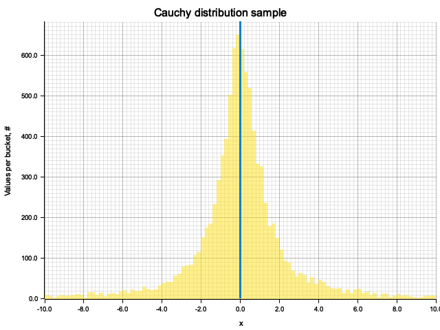
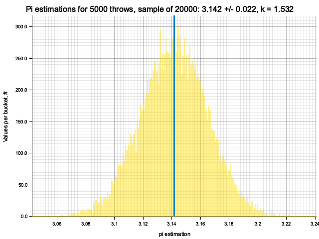
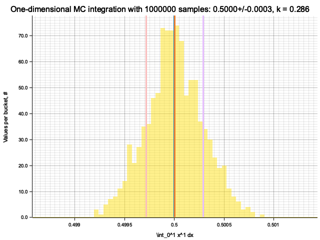
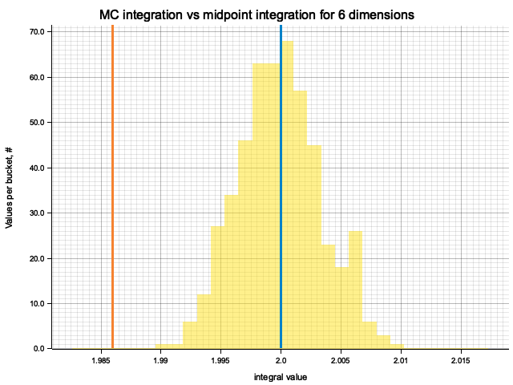
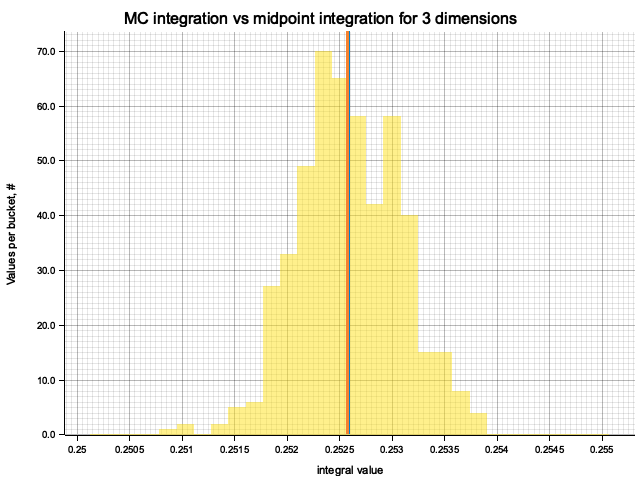

# LE-6 Monte Carlo techniques: Excercises

*Igor Vaiman*

## Introduction

The exercises are done in Rust programming language. It's not widely used in physics
community but hopefully can see wider adoption in the future. In combines access to
low-level performance and fine control with high-level features of modern programming
languages. Its emphasis on memory safety, "fearless concurrency" and compile-time error
detection might be helpful in parallelizing scientific tasks.

## Ex. 1: Uniform random sampling

!include[Source code](src/ex1.rs)(rust)
!include[Execution log](out/ex1/ex1.log)

The exercise is to write a Multiplicative Congruent Generator (MCG) that produces
a stream of numbers according to the rule $X_{i+1} = (M \cdot X_{i}) \text{mod} N$.
$N$ is fixed to $2^{32}$ by the fact that we're dealing with unsigned 32-bit integers
(`u32` Rust datatype) and use overflowing multiplication that wraps numbers on overflow.
The MCG then has two parameters: a multiplier $M$ and an initial value $X_0$.

Results for MCG with initial value: 987654321 and multiplier: 663608941:
```
Full iteration: 1073741824 steps (log2(steps) = 30), took 1.03 seconds
```

Samples from this MCG with different sizes and with $\chi^2 / \text{d.o.f.}$ test
of uniformity:


I decided to try other, rather small and not specifically selected parameters: 
initial value: 10 and multiplier: 9. The cycle size is 4 times shorter, $2^{28}$, but the
distributions look fairly flat anyway. Perhaps, the sample is much more correlated
in this case.

<details>
<summary>Samples</summary>


</details>

### Ex. 1.1: MINSTD algorithm

Again, MINST is an MCG with multiplier $M = 7^5 = 16807$, but $N$ is not a Mersenne prime $2^{31} - 1$.
This requires one to use 64-bit integer type and perform modulus operation explicitly. But for that we
get a longer sequence, spanning the full range of $2^{31} - 1$, and this seems to happen irrespective
of the seed (initial value).

## Ex. 2: Random sampling

!include[Source code](src/ex2.rs)(rust)
!include[Execution log](out/ex2/ex2.log)

### Ex. 2.1: Inversion

Inverted CDF for Cauchy distribution is: $C^{-1}(t) = \tan(\pi (t - \frac{1}{2}))$.

Using it, we obtain a sample:



### Ex. 2.2: Inversion and rejection

In principle, the result could depend on compiler optimizations. In Rust, optimizations are
controlled by `--release` flag. Both with and without this flag the analytic method works
faster, at least on my machine, but optimization makes the lead more pronounced:

|                             	| Analytic 	| Rejection 	|
|-----------------------------	|----------	|-----------	|
| Debug build (non-optimized) 	| 52.78    	| 65.49     	|
| Release build (optimized)   	| 1.07     	| 1.94      	|


## Ex. 3: Numerical estimation of $\pi$

!include[Source code](src/ex3.rs)(rust)
!include[Execution log](out/ex3/ex3.log)

To check the convergence, I plot the logarithm of absolute estimation error
vs. the number of throws. All traces converge (error decreases), but rather
slowly and with large fluctuations.


### Ex. 3.1: Uncertainty evaluation

To estimate the error, we can fix the number of throws $N$ and repeat the procedure to get the
distribution of the $\pi$ estimate. From it, we obtain the Gaussian-looking sample of $\pi$ and
calculate the scaling factor $k \equiv \sigma \sqrt{N}$, which turns out to be around 1-2,
although it fluctuates significantly and seems to depend on the number of throws.
So, using the conservative value of $k=2$ we conclude, that to get the precision
$\sigma = 10^{-4}$, we need to throw at least
$N = \left( \frac{k}{\sigma} \right)^2 = 4 \cdot 10^8$ points.





## Ex. 5: Monte-Carlo integration

!include[Source code](src/ex5.rs)(rust)
!include[Execution log](out/ex5/ex5.log)

### Ex. 5.1: Unidimensional integration

To estimate the number of samples required for a given precision, we can use the same
dependence of estimation's variance $\sigma \propto N^{-1/2}$. In the previous exercise
the coefficient $k$ in this dependence was shown to be of order $1$. Using this rough
value, we obtain the number of samples required for precision $\sigma = 0.001$:
$N = \sigma^{-2} = 10^6$.

From the samples we obtain the actual value $k \approx 0.2$, so the actual error is
factor of $5$ smaller than the required value.




### Ex. 5.2: Multidimensional integration

For each dimension I produce 500 MC integrations and compare them with the midpoint
formula and the true integral value. Since the number of samples for MC and cells
for midpoint formula is chosen to be equal, evaluation time of the methods is within
an order of magnitude from each other, with MC integration taking $\approx 2$ times more
time for large numbers of dimensions.

On the plots below, blue line is the true integral value, orange line is midpoint approximation
result, yellow histogram is MC integration results distribution.

For low number of dimensions the MC integration introduces additional error:


For higher dimensionality, the midpoint approximation introduces significant bias,
while MC integration stays consistent.


<details>

<summary>Plots for all dimensions</summary>





</details>


### Ex. 5.3: Multidimensional integration for product of exponents

Qualitatively the results are the same as for previous exercise, but the "critical"
number of dimensions, at which midpoint integration becomes worse than MC, is higher.
For example, the previous function in 5 dimensions would be better integrated by MC,
while for this one the errors of two methods are comparable.

The explaination is as follows, considering one dimension for clarity:
on $x \in [0, 1]$ the previous function $x^2$ varies in $[0, 1]$, while the exponent
varies only in $[0, e^{-1} \approx 0.37]$. So, the previous function is "cuspier",
making midpoint formula more biased as it doesn't probe the peak and underestimates
the integral.

<details>

<summary>Plots for all dimensions</summary>





</details>


