# LE-6 Monte Carlo techniques: exercises

Igor Vaiman

## Introduction

The exercises are done in Rust programming language. It's not widely used in physics
community but hopefully can see wider adoption in the future. In combines access to
low-level performance and fine-grained control with high-level features of modern programming
languages. Its emphasis on memory safety, "fearless concurrency" and compile-time error
detection might be helpful in parallelizing scientific tasks.

## Ex. 1: Uniform random sampling

!include[Source code](src/ex1.rs)(rust)
!include[Execution log](out/ex1/ex1.log)

The exercise is to write a Multiplicative Congruent Generator (MCG) that produces
a stream of numbers according to the rule $X_{i+1} = (M \cdot X_{i}) \text{mod} N$.
$N$ is fixed to $2^{32}$ by the fact that we're using unsigned 32-bit integers
(`u32` Rust datatype) and use wrapping multiplication (which in Rust must be explicitly
asked for with `a.wrapping_mul(b)`). The MCG then has two parameters:
a multiplier $M$ and an initial value $X_0$.

Results for MCG with initial value: 987654321 and multiplier: 663608941:
```
Full iteration: 1073741824 steps (log2(steps) = 30), took 1.03 seconds
```

Samples from this MCG with different sizes and with $\chi^2 / \text{d.o.f.}$ test
of uniformity:


I decided to try another, not specifically selected parameters to see the impact on the output.
With initial value: 10 and multiplier: 9 the cycle size is 4 times shorter, $2^{28}$, but the
distributions look fairly flat. Perhaps, the sample is much more correlated in this case.

<details>
<summary>Samples</summary>


</details>

### Ex. 1.1: MINSTD algorithm

Again, MINST is an MCG with multiplier $M = 7^5 = 16807$, but $N$ is now a Mersenne prime $2^{31} - 1$.
This requires one to use 64-bit integer type and perform modulus operation explicitly. in return we
get a longer sequence, spanning the full range of $2^{31} - 1$ possible values, and this seems
to happen irrespective of the seed (initial value).

## Ex. 2: Random sampling

!include[Source code](src/ex2.rs)(rust)
!include[Execution log](out/ex2/ex2.log)

### Ex. 2.1: Inversion

Inverted CDF for Cauchy distribution is: $C^{-1}(t) = \tan(\pi (t - \frac{1}{2}))$.

Using it, we obtain a sample:


### Ex. 2.2: Inversion and rejection

In principle, the result could depend on compiler optimizations. In Rust, optimizations are
controlled by `--release` flag. Both with and without this flag, the analytic method works
faster, but optimization makes its lead much more pronounced:

|                             	| Analytic 	| Rejection 	|
|-----------------------------	|----------	|-----------	|
| Debug build (non-optimized) 	| 52.78    	| 65.49     	|
| Release build (optimized)   	| 1.07     	| 1.94      	|


## Ex. 3: Numerical estimation of $\pi$

!include[Source code](src/ex3.rs)(rust)
!include[Execution log](out/ex3/ex3.log)

To check the convergence, I plot the logarithm of absolute estimation error
vs. the number of throws. All traces converge (error decreases), but rather
slowly and with large fluctuations.


### Ex. 3.1: Uncertainty evaluation

To estimate the error, we can fix the number of throws $N$ and repeat the procedure to get the
distribution of the $\pi$ estimate. From it, we obtain the Gaussian-looking sample of estimates and
calculate the scaling factor $k \equiv \sigma \sqrt{N}$, which turns out to be around 1-2,
although it fluctuates significantly and seems to depend on the number of throws.
Using the conservative value of $k=2$ we conclude that to get the precision
$\sigma = 10^{-4}$, we need to throw at least
$N = \left( \frac{k}{\sigma} \right)^2 = 4 \cdot 10^8$ points.


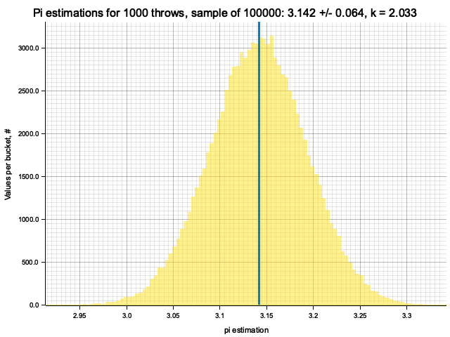


## Ex. 5: Monte-Carlo integration

!include[Source code](src/ex5.rs)(rust)
!include[Execution log](out/ex5/ex5.log)

### Ex. 5.1: Unidimensional integration

To estimate the number of samples required for a given precision, we can use the same
dependence of estimation's variance $\sigma \propto N^{-1/2}$. In the previous exercise
the coefficient $k$ in this dependence was shown to be of order $1$. Using this rough
value, we obtain the number of samples required for precision $\sigma = 0.001$:
$N = \sigma^{-2} = 10^6$.

From the samples we estimate the actual value $k \approx 0.1 - 0.5$, so the error is
a factor of $2-10$ smaller than the required value.


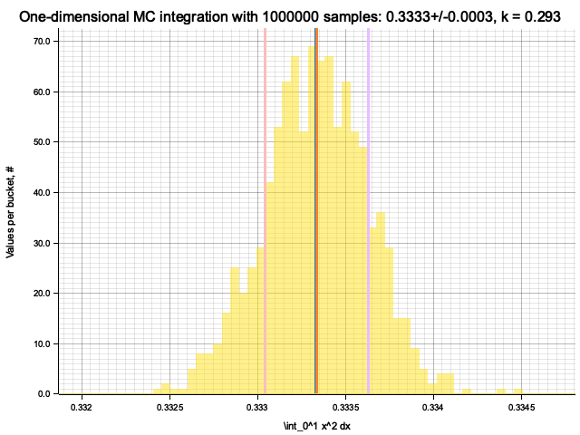


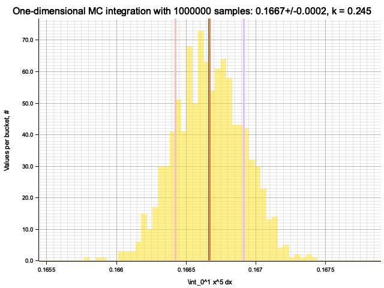

### Ex. 5.2: Multidimensional integration

For each dimension I produce 500 MC integrations and compare them with the midpoint
formula and the true integral value. Since the number of samples for MC and cells
for midpoint formula is chosen to be equal, evaluation time of the methods is within
an order of magnitude from each other, with MC integration taking $\approx 2$ times more
time for large numbers of dimensions.

In the plots below, blue line is the true integral value, orange line is midpoint approximation
result, yellow histogram is MC integration results distribution.

For a low number of dimensions the MC integration introduces additional error:

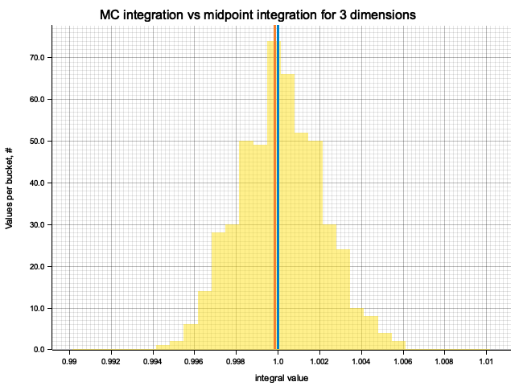

For higher dimensionality, the midpoint approximation introduces significant bias,
while MC integration stays consistent.

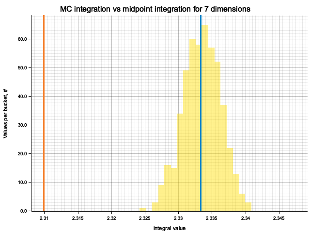

<details>

<summary>Plots for all dimensions</summary>


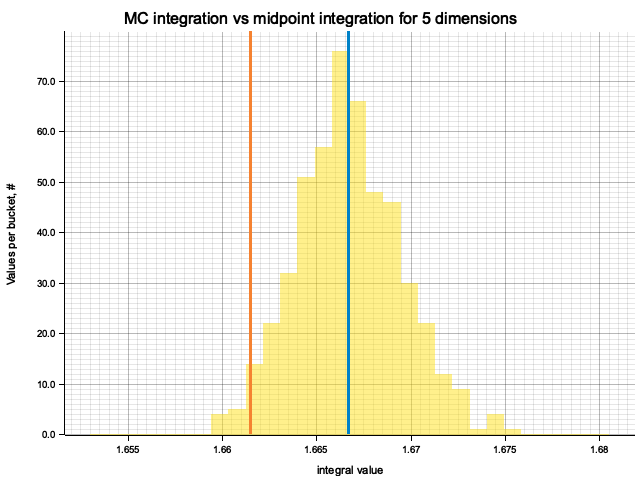


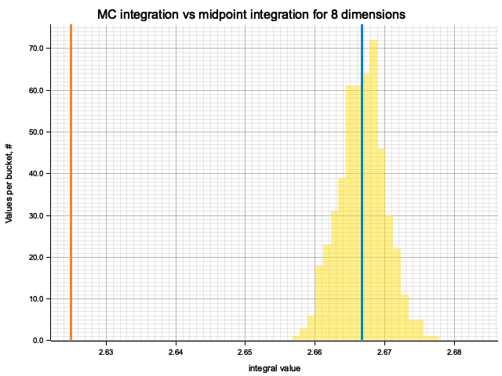

</details>


### Ex. 5.3: Multidimensional integration for product of exponents

Qualitatively, the results are the same as for previous exercise, but the "critical"
number of dimensions, at which midpoint integration becomes worse than MC, is higher.
For example, in 5 dimensions the previous function would be better integrated by MC,
while for this one the errors of two methods are comparable.

The explaination is as follows, considering one dimension for clarity:
on $x \in [0, 1]$ the function $x^2$ varies in $[0, 1]$, while the $e^{-x}$ - only
in $[0, e^{-1}] \approx [0, 0.37]$. So, the previous function is "cuspier",
making midpoint formula more biased: it can't probe the peak and underestimates
the integral.

<details>

<summary>Plots for all dimensions</summary>


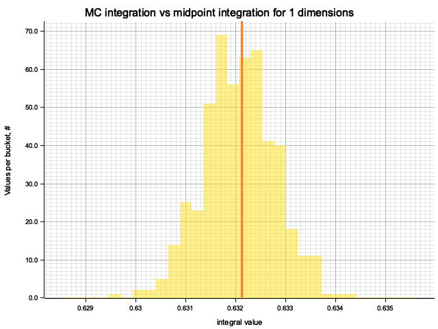


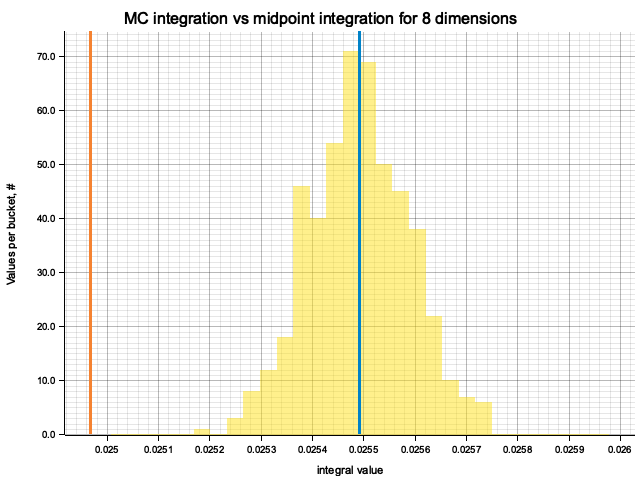

</details>


## Ex. 6: Truncation errors

!include[Source code](src/ex6.rs)(rust)
!include[Execution log](out/ex6/ex6.log)

In addition to single and double precision floats (correspondingly `f32` and `f64` in Rust)
I've tried half-precison 16-bit float:

| n | half (f16)   | single (f32) | double (f64)|
| --- | --- | --- | --- |
| 100 | 0.98828125   | 0.99999934   | 1.0000000000000007|
| 1000 | 0.9785156    | 0.9999907    | 1.0000000000000007|
| 10000 | 0.25         | 1.0000535    | 0.9999999999999062|
| 100000 | 0            | 1.0009902    | 0.9999999999980838|
| 1000000 | 0            | 1.0090389    | 1.000000000007918|


## Ex. 7: Tracking algorithms

!include[Source code](src/ex7.rs)(rust)
!include[Execution log](out/ex7/ex7.log)

### Proof

Consider two random variables $s_{1}$, $s_2$ and the random variable
$s \equiv \min(s_1, s_2)$. We need to find the disribution of $s$.

By definition, $s$ takes the smalles value of the $s_1, s_2$ pair.
Therefore, for $s$ to have a particular value $x$ requires either $s_1$ to be equal to $x$
and $s_2$ to be greater than $s_1$, or vice versa. We can write it as

$$
P(s \in (x, x + dx)) = P(s_1 \in (x, x + dx)) P( s_2 > x ) + P(s_2 \in (x, x + dx)) P( s_1 > x )
$$

Denoting PDF as $f$ and CDF as $C$, we write

$$
f_s(x) = f_{s_1}(x) (1 - C_{s_2}(x)) + f_{s_2}(x) (1 - C_{s_1}(x))
$$

Now, considering the case of interest $s_{1, 2} = \mathrm{Exp}(\mu_{1, 2})$, we get

$$
f_s(x) =
\mu_1 e^{-\mu_1 x} \cdot e^{-\mu_2 x} + \mu_2 e^{-\mu_2 x} \cdot e^{-\mu_1 x} =
(\mu_1 + \mu_2) e^{-(\mu_1 + \mu_2)x}
$$

And it follows that $s \sim \mathrm{Exp}(\mu_1 + \mu_2)$

For a more general proof in the case $s = \sum_i s_i$, we can either do it inductively,
or write in more general form

$$
\begin{aligned}
f_s(x) &= \sum_i f_{s_i}(x) \prod_{j, j \ne i} (1 - C_{s_j}(x)) \\
&= \sum_i \mu_i e^{-\mu_i x} \prod_{j, j \ne i} e^{-\mu_j x} \\
&= \sum_i \mu_i e^{-\mu_i x}  e^{- \left(\sum_{j, j \ne i} \mu_j \right) x} \\
&= \sum_i \mu_i e^{- \left(\mu_i + \sum_{j, j \ne i} \mu_j \right) x} \\
&= \sum_i \mu_i e^{- \left(\sum_{j} \mu_j \right) x} \\
&= \left( \sum_i \mu_i \right) \cdot e^{- \left(\sum_{j} \mu_j \right) x}
\end{aligned}
$$

And, denoting $\mu \equiv \sum_i \mu_i$, we see that $s \sim \mathrm{Exp}(\mu)$


### Brute-force results

The samples obtained by two methods are identical:

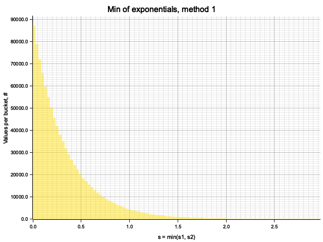


### Samplling fraction

From Monte-Carlo simulation of competing processes with $\mu = [1, 2, 3, 4, 5, 6]$
we get

```
process #0: 4.787% of samples, 100*mu_i/mu = 4.7619047
process #1: 9.556% of samples, 100*mu_i/mu = 9.523809
process #2: 14.226% of samples, 100*mu_i/mu = 14.285714
process #3: 19.068% of samples, 100*mu_i/mu = 19.047619
process #4: 23.855% of samples, 100*mu_i/mu = 23.809525
process #5: 28.508% of samples, 100*mu_i/mu = 28.571428
```

To rigorously prove this, consider a set of exponential random variables
$s_i = \mathrm{Exp}(\mu_i)$ and compute the probability for the $i$-th value to be the smallest one

$$
\begin{aligned}
P(s_i < s_j, j \ne i)
&= \int_0^{+\infty} dx f_{s_i}(x) \prod_{j, j \ne i} (1 - C_{s_j}(x)) \\
&= \int_0^{+\infty} dx \mu_i e^{- \mu_i x} e^{- \left(\sum_{j, j \ne i} \mu_j \right) x} \\
&= \mu_i \int_0^{+\infty} dx e^{- \left(\mu_i + \sum_{j, j \ne i} \mu_j \right) x} \\
&= \mu_i \int_0^{+\infty} dx e^{- \mu x} \\
&= \frac {\mu_i} {\mu} \\
\end{aligned}
$$

## Ex. 8: Compton interaction sampling

!include[Source code](src/ex8.rs)(rust)
!include[Execution log](out/ex8/ex8.log)

To sample Klein-Nishina, we can express it as a function of $\cos(\theta)$ and do a regular rejection
sampling: repeatedly propose its value $t$ and accept it with probability equal to
$\frac{1}{r_e^2} \frac{d\sigma}{d\Omega}$ - Klein-Nishina cross-section, normalized to be equal to $1$ at
$\theta = 0 \Rightarrow \cos(\theta) = 1$. Sampling $\cos(\theta)$ implicitly takes care of spherical
Jacobian, so the sampled direction is not uniform in $\theta$ but actually isotropic on a 3D sphere.

After obtaining the value $\cos(\theta) = t$ from rejection sampling, we say that the photon will
be scattered to angle $\theta = \mathrm{arccos}(t)$ and it's energy will be changed by the factor
$\frac{E'}{E} = \frac{1}{1 + \kappa t}$ ($\kappa \equiv E / m_e c^2$).

Example distribution for $\kappa = 0.5$:


<details>

<summary>Plots for different values of k</summary>


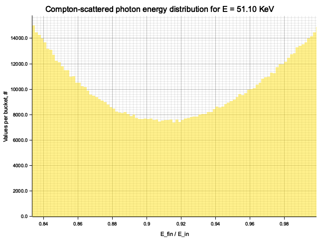


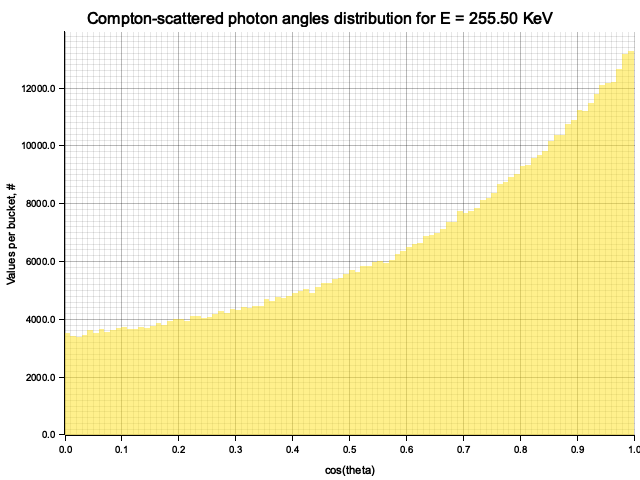


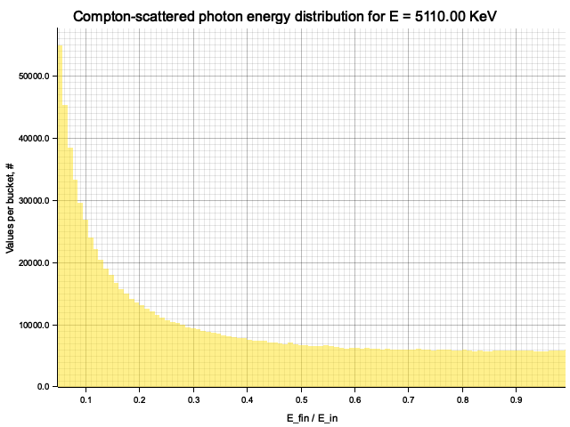
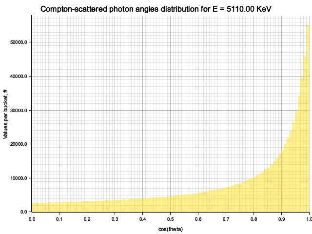
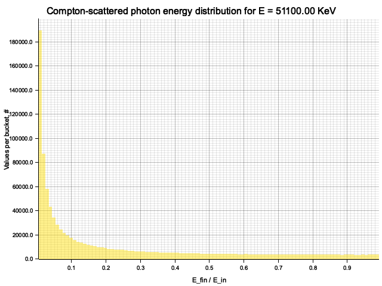
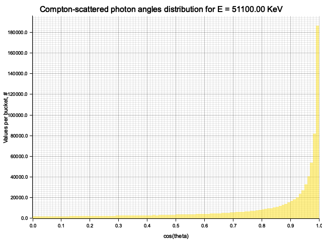

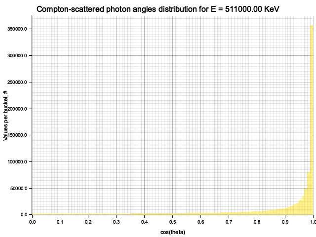

</details>


## 3D tracking of Compton-scattered photon

!include[Source code](src/compton_mc.rs)(rust)

As an exercise, I wanted to use the Klein-Nishina cross-section sampling from Ex. 8
to make a very simple particle tracking simulation. The medium is modeled as a cuboid with
constant density, atomic mass and number. A single photon is injected to the material from
the side, and is tracked as it propagates, experiencing Compton scatterings, until it leaves
the volume or is "absorbed" (see below).

In this simple setup, the photon quickly loses energy through highly inelastic scattering events,
and goes into low-energy regime, where it keeps almost all of it's energy and scatters almost
isotropically. The result is a random walk:

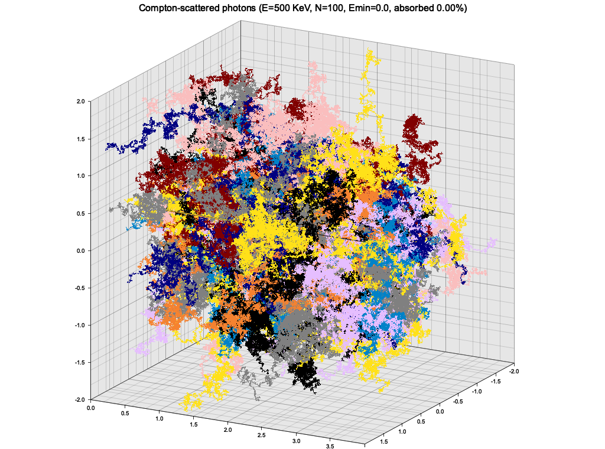

This is of course not a realistic picture, because at this low energy the photons would start
experiencing photoelectric effect. To roughly account for that, I introduced a minimum energy
of 1 KeV, below which the photon propagation is halted and it is considered "absorbed".


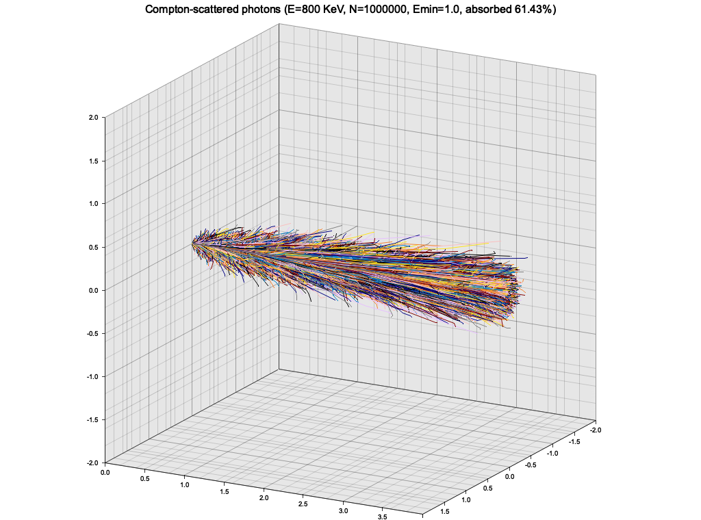
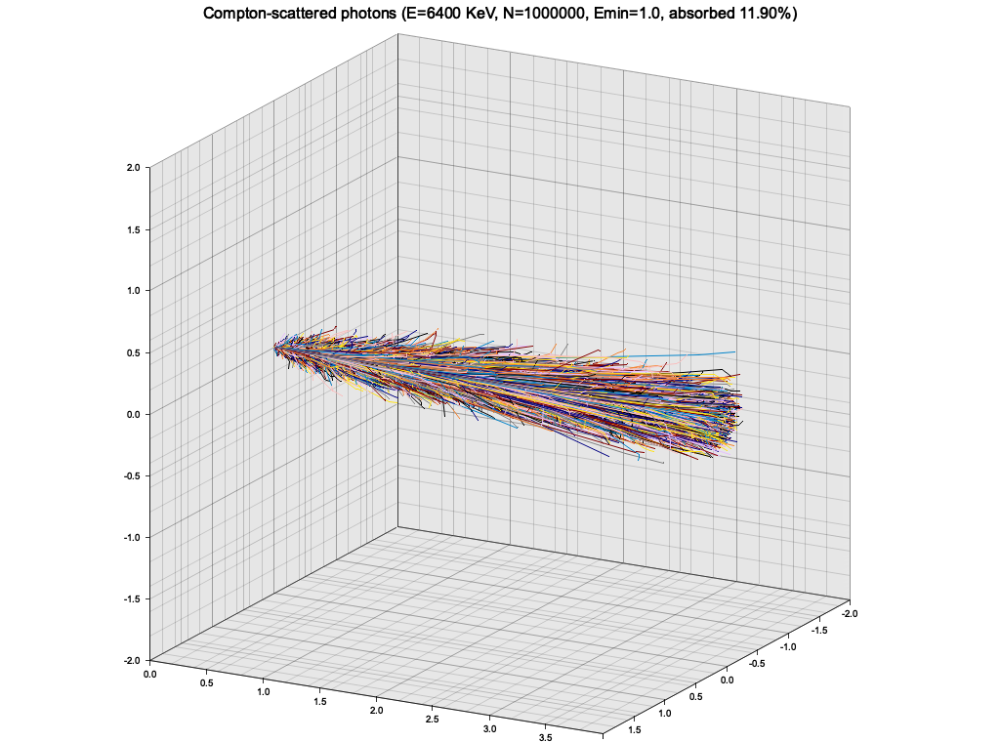

I also tried plotting a distribution of photons exiting the metrial on the "back side"
as a 2D histogram in log brightness, but it turned out to be not very interesting,
and not depend significantly on photon's energy.


